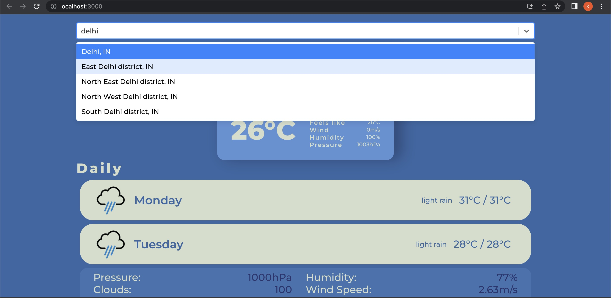
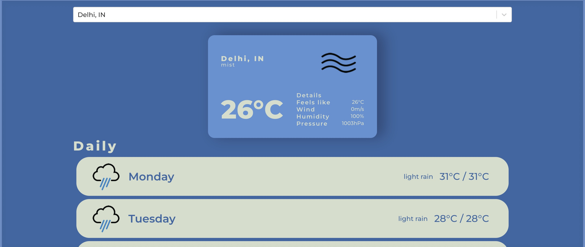
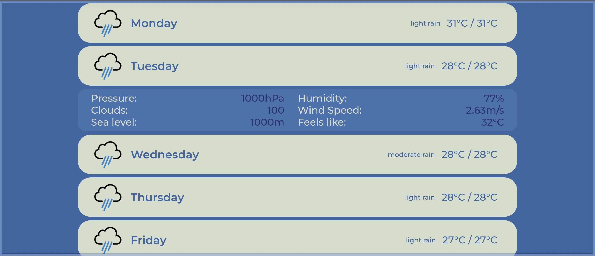

# weather-app
A react weather app that shows current weather and 5-day forecast using openweathermap api and rapidapi.

# components 
1. Search- uses async paginate package to create search bar and results are fetched from the rapidapi.

2. Current weather- shows the current weather of the selected city using openweathermap api.

3. forecast component- shows the weather forecast for next 5 days for the selected city using openweathermap api.
